# H-Commerce

A full-stack e-commerce web app built with Django REST Framework and React.

> 🔗 **Live Demo:** [https://e-commerce-website-wzv3.onrender.com](https://e-commerce-website-wzv3.onrender.com)
> ⚠️ Hosted on Render's free tier — the first load may take ~30 seconds to spin up.

---

## Screenshots

| Home | Item Detail |
|------|------------|
| 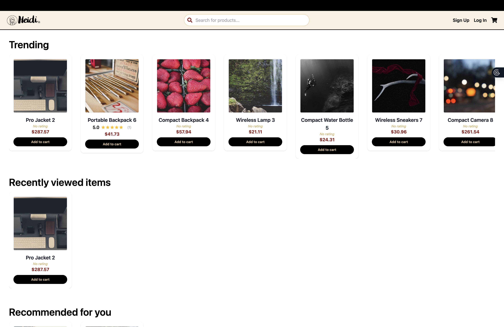 | 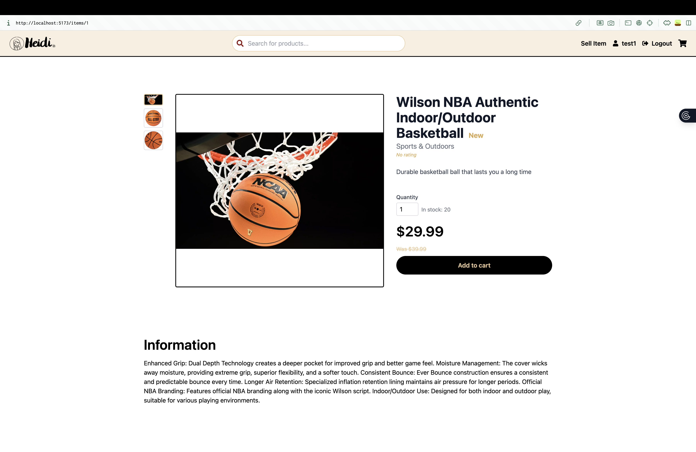 |

| Login | Register |
|-------|----------|
| 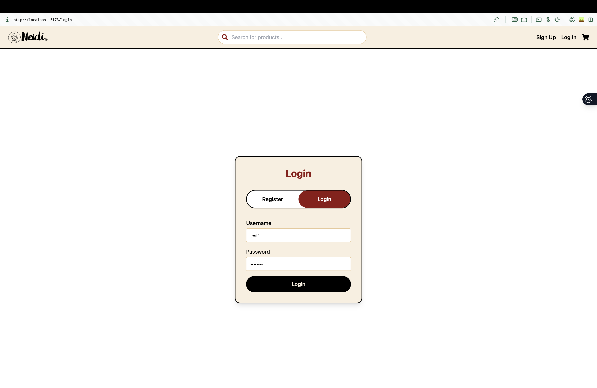 | 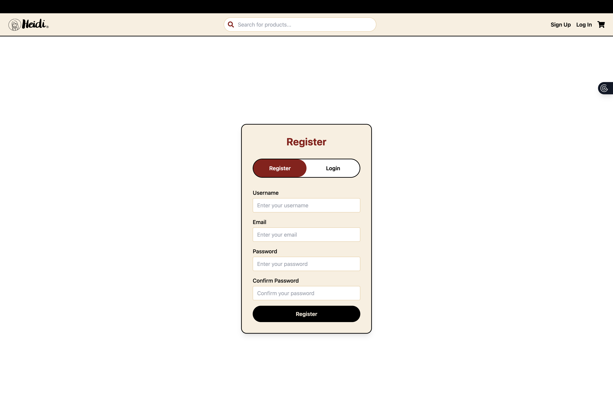 |

| Cart | Checkout | Order |
|------|----------|-------|
| 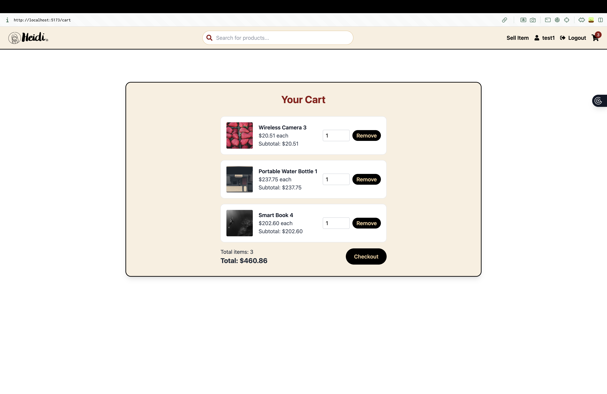 | 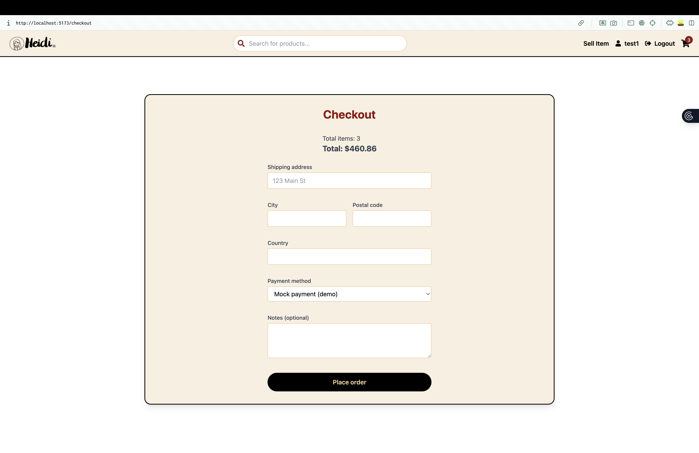 | 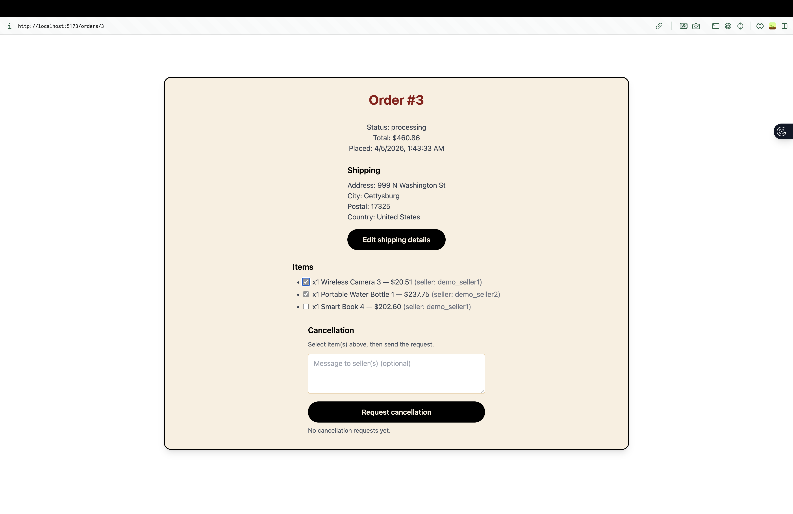 |

| Add Item | Add Item (cont.) |
|----------|-----------------|
| 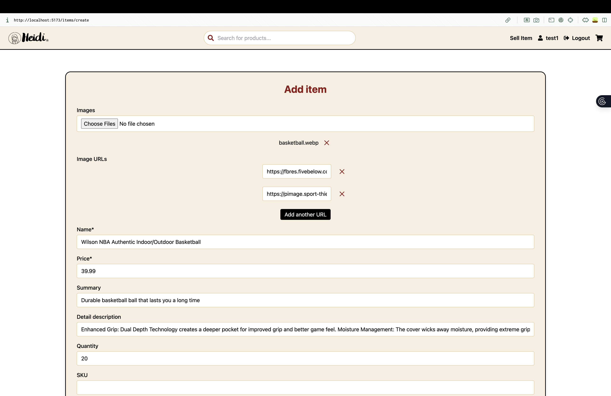 | 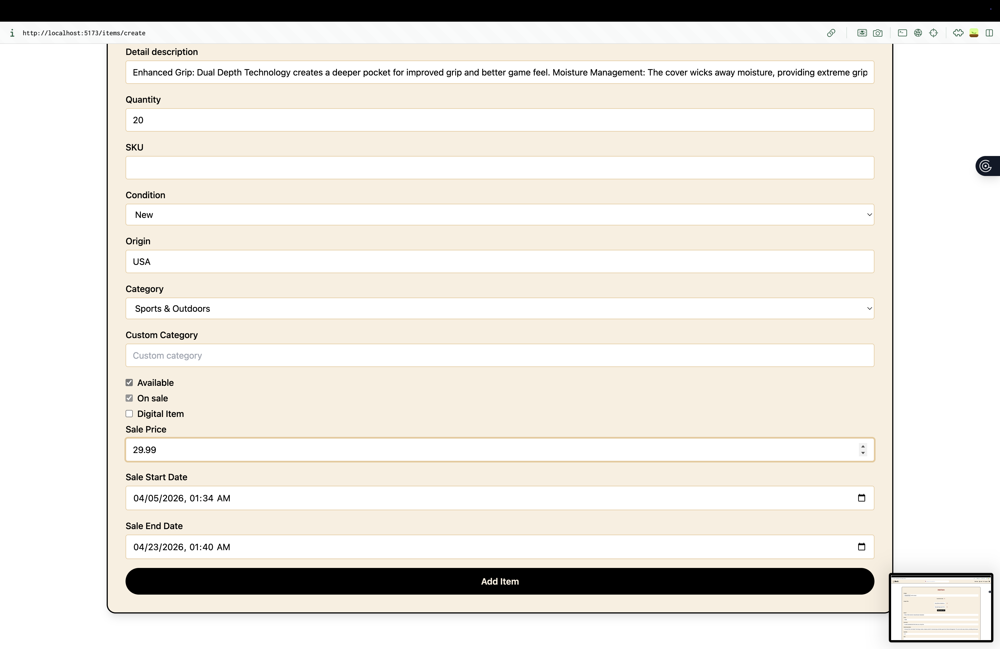 |

| Seller Profile | Seller View of Order | Seller Accept Cancellation |
|----------------|----------------------|---------------------------|
| 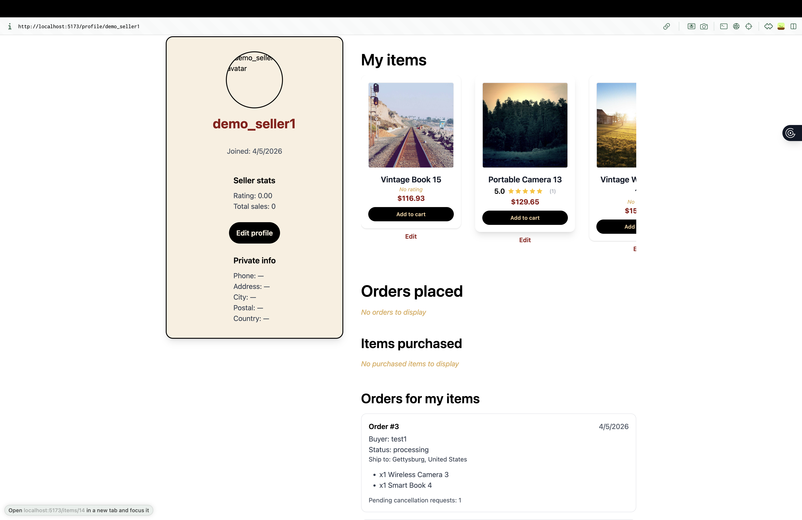 | 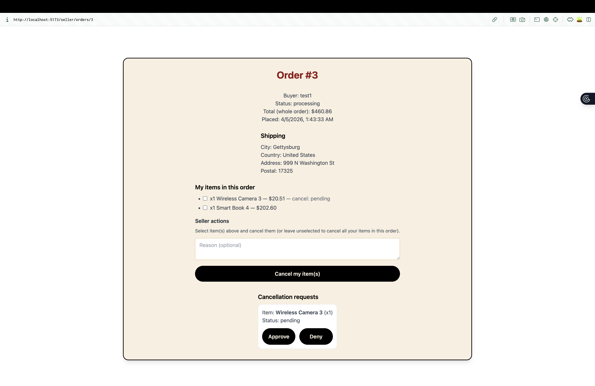 | 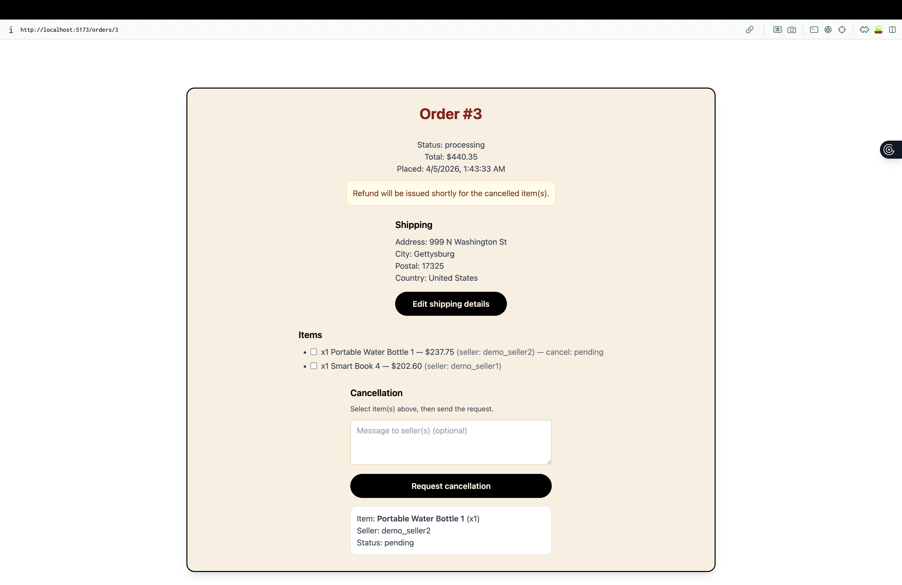 |

---

## Features

- JWT auth (login/register), profile pages
- Items: list/detail, create/edit (seller flow)
- Cart + checkout flow with stock validation
- Orders: buyer order history + order detail
- Buyer shipping edits (while order is processing)
- Partial cancellation workflow: buyer requests cancellation for specific order items; seller approves/denies per item
- Seller dashboard: sellers see orders that include their items + pending cancellation requests

## Tech stack

- **Backend:** Django, Django REST Framework, SimpleJWT, drf-spectacular
- **Frontend:** React, Vite, TailwindCSS
- **DB:** SQLite (local), supports Postgres via `DATABASE_URL`

## Prerequisites

- Python 3.12+
- Node.js 18+

## Local setup

### 1) Backend

**macOS / Linux**
```bash
cd backend
cp .env.example .env
python -m venv .venv
source .venv/bin/activate
pip install -r requirements.txt
python manage.py migrate
python manage.py runserver
```

**Windows (PowerShell)**
```powershell
cd backend
Copy-Item .env.example .env
python -m venv .venv
.\.venv\Scripts\Activate.ps1
pip install -r requirements.txt
python manage.py migrate
python manage.py runserver
```

> The default `.env` values work for local development. The `DJANGO_SECRET_KEY` placeholder is fine locally — change it before any public deployment.

Backend runs at `http://127.0.0.1:8000/`
API docs (Swagger): `http://127.0.0.1:8000/api/docs/`

### 2) Frontend

**macOS / Linux**
```bash
cd frontend
cp .env.example .env
npm install
npm run dev
```

**Windows (PowerShell)**
```powershell
cd frontend
Copy-Item .env.example .env
npm install
npm run dev
```

Frontend runs at `http://localhost:5173/` (or the next free port).

## Seed demo items

```bash
cd backend
python manage.py seed_items 50
```

## Run tests

```bash
cd backend
python manage.py test
```

## Deployment

### Backend — Render / Railway / Fly

1. Create a **Postgres** database and copy the connection string.
2. Set these environment variables on your hosting service:

| Variable | Value |
|---|---|
| `DJANGO_SECRET_KEY` | a long random string |
| `DJANGO_DEBUG` | `0` |
| `DJANGO_ALLOWED_HOSTS` | your backend domain, e.g. `my-api.onrender.com` |
| `DATABASE_URL` | your Postgres connection string |
| `CORS_ALLOWED_ORIGINS` | your frontend URL, e.g. `https://my-app.vercel.app` |
| `CSRF_TRUSTED_ORIGINS` | same as `CORS_ALLOWED_ORIGINS` |
| `DJANGO_SECURE_SSL_REDIRECT` | `1` |
| `DJANGO_SESSION_COOKIE_SECURE` | `1` |
| `DJANGO_CSRF_COOKIE_SECURE` | `1` |

3. Set the **build command**:
   ```
   pip install -r requirements.txt && python manage.py migrate && python manage.py collectstatic --noinput
   ```
4. Set the **start command** (or use the included `Procfile`):
   ```
   gunicorn core.wsgi:application
   ```

### Frontend — Vercel / Netlify

1. Set `VITE_API_URL` to your deployed backend URL ending with `/api/`, e.g. `https://my-api.onrender.com/api/`.
2. Build command: `npm run build` — output directory: `dist`.

### Media uploads

The default config stores uploaded images on disk, which is non-persistent on most cloud platforms. For production, set `USE_S3=1` and fill in the AWS credentials in your env vars (see [backend/.env.example](backend/.env.example)).

---

## What I Learned & Challenges

- **JWT auth flow** — implementing token refresh logic on the frontend required careful handling of expired access tokens; solved it by intercepting 401 responses in Axios and silently refreshing before retrying the original request
- **Partial cancellation workflow** — designing a system where buyers can cancel individual order items (not the whole order) while sellers approve/deny each request required a separate `OrderItemCancellation` model and careful state management across buyer and seller views
- **Stock validation** — preventing race conditions during checkout (two buyers purchasing the last item simultaneously) required validating and decrementing stock atomically on the backend rather than trusting frontend state
- **Seller vs buyer views** — building a dual-role system where the same user can be both a buyer and a seller required careful permission checks on every endpoint to ensure users can only see and modify their own data
- **CORS + deployment** — connecting a separately deployed Django backend (Render) to a React frontend (Vercel) required correctly configuring CORS headers, CSRF trusted origins, and environment variables across both platforms
